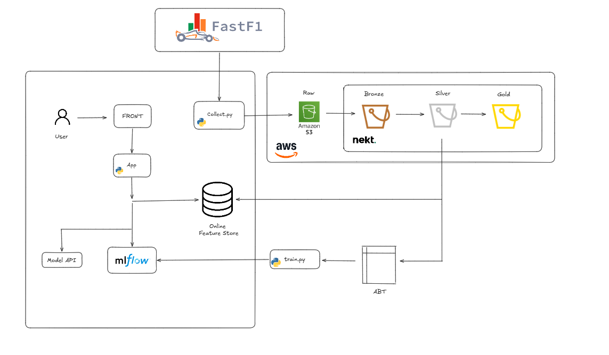

# F1 Project

Projeto voltado a coleta, armazenamento e processamento de dados de Formula 1 para suporte a analises e modelos preditivos.

## Arquitetura inicial do projeto

## Visao geral

Este repositório organiza a base de um pipeline de dados para Formula 1, cobrindo desde a coleta historica ate a disponibilizacao dos dados para consumo analitico e modelagem.

## Etapas do projeto

### Coleta

A coleta de dados sera feita com a biblioteca FastF1, por meio de scripts em Python responsaveis pela extracao das informacoes historicas.

Essa etapa sera executada em um servidor proprio, com agendamento automatico.

### Envio dos dados

Apos a coleta, os dados serao enviados para um bucket S3 na AWS. Dessa forma, a Nekt podera consumir os arquivos brutos e realizar a ingestao no Lakehouse.

Nesse contexto, o S3 atua como camada raw, ou camada de dados brutos.

### Camada Bronze

Na camada bronze, os dados serao consolidados em formato Delta, com historico de modificacoes e representacao fiel da origem dos registros.

### Camada Silver

A partir da camada anterior, o Lakehouse permite novas modelagens de dados e a criacao de Feature Stores com o historico de cada entidade de interesse.

### Camada Gold

Nesta camada, os dados sao organizados em tabelas sumarizadas e orientadas a relatorios, prontas para consumo em ferramentas de BI e dashboards.

### Treinamento do modelo

Com os dados das Feature Stores e dos eventos de interesse, sera gerada uma Analytical Base Table (ABT) para treinamento dos modelos de Machine Learning.

Os modelos serao treinados e comparados localmente, com uso do MLflow hospedado em servidor proprio.

### Aplicacao para usuario

Com o modelo treinado, a etapa final consiste em uma aplicacao para exibicao das predicoes a usuarios interessados em Formula 1.

